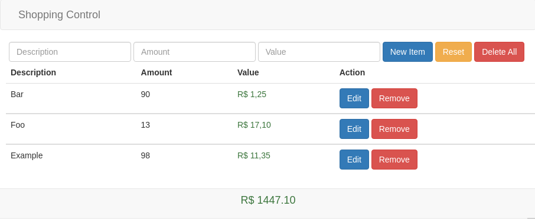

<h1 align="center"> Web System </h1>
<h5 align="center" font-weigth="bold"> Create, read, update and delete </h5>

  <h3>Layout<h2/>
  
  

### Main technologies used
  
 
    
- [Javascript](https://developer.mozilla.org/en-US/docs/Web/JavaScript/) - JavaScript, often abbreviated as JS, is a programming language that conforms to the ECMAScript specification. JavaScript is high-level, often just-in-time compiled, and multi-paradigm. It has curly-bracket syntax, dynamic typing, prototype-based object-orientation, and first-class functions.

- [HTML](https://developer.mozilla.org/en-US/docs/Web/HTML) - The HyperText Markup Language, or HTML is the standard markup language for documents designed to 
be displayed in a web browser. It can be assisted by technologies such as Cascading Style Sheets and scripting languages such as JavaScript.

### Requirements to run the application on your machine
  To run, just have a Web Browser compatible with technologies. 
